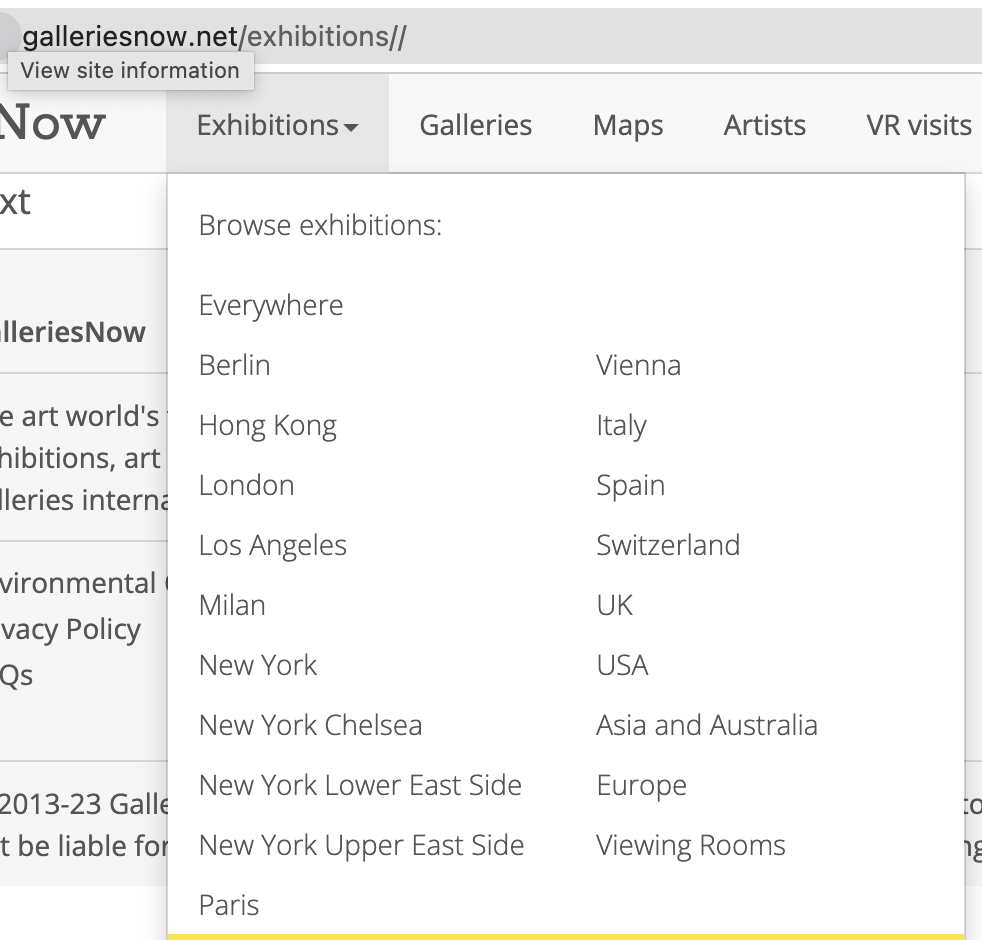

# wikiart_data_scraper

Scrape wikiart.org. Get artists + content

Run craper for wikiart.org

```shell
PIPELINE=wikidata make run
```

# Scrape galleries

For file versioning

```shell
	brew install md5sha1sum
```

Find a link to a city



Update YML config with selected links then run collector

```shell
PIPELINE=galleries make run
```

# Work in progress

Refactor code with [multiprocessing](https://www.zenrows.com/blog/speed-up-web-scraping-with-concurrency-in-python#concurrency)

New data source: Artsy. Selenium  needed =/

[italy](https://www.artsy.net/galleries?location=milan-italy) - automatically tap show_more
